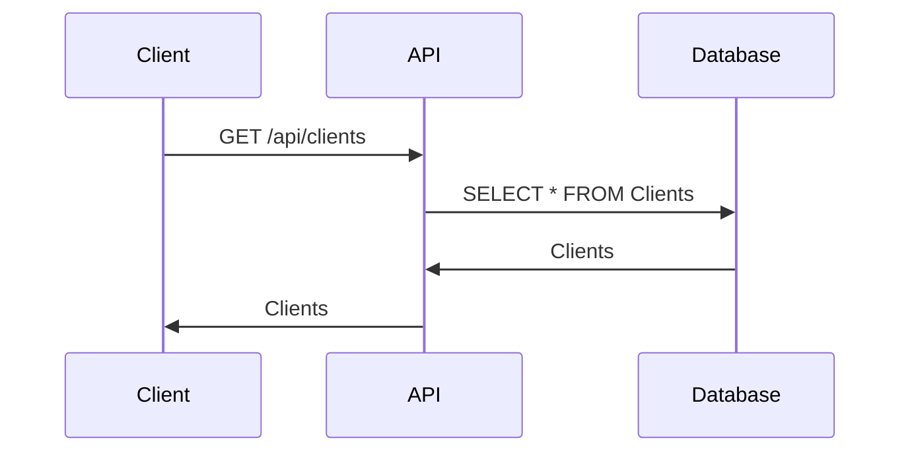
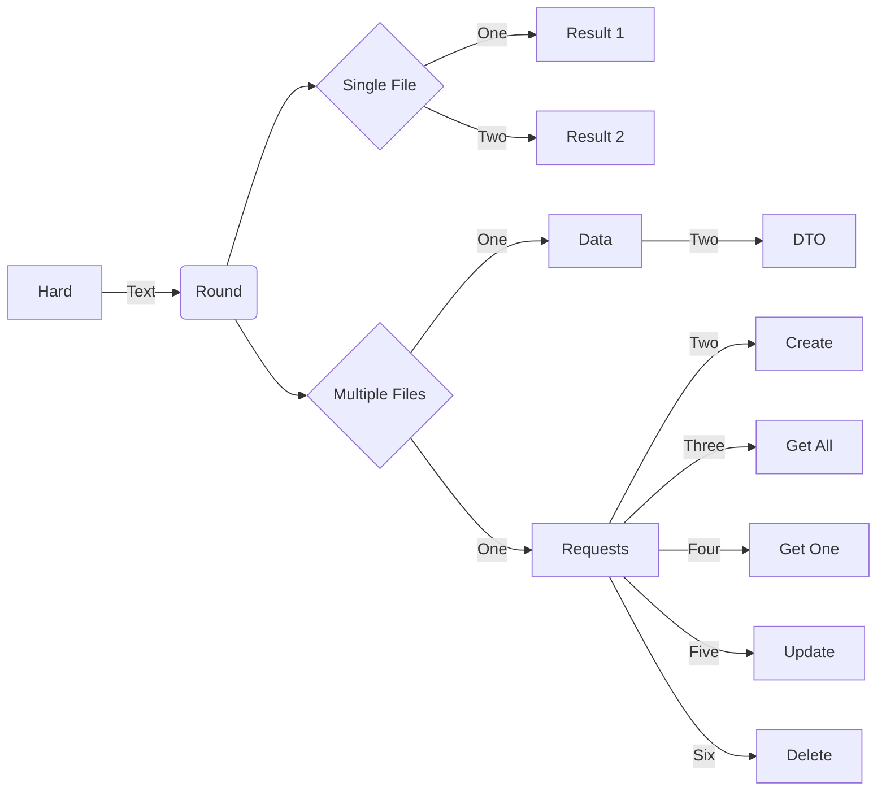

## Diagrams

### Request/Response Flow

```mermaid
sequenceDiagram
    participant Client
    participant API
    participant Database
    Client->>API: GET /api/clients
    API->>Database: SELECT * FROM Clients
    Database->>API: Clients
    API->>Client: Clients
```

```mermaid
flowchart LR
A[Hard] -->|Text| B(Round)
B --> C{Single File}
B --> D{Multiple Files}
C -->|One| E[Result 1]
C -->|Two| F[Result 2]
D -->|One| G[Data]
D -->|One| I[Requests]
G -->|Two| H[DTO]
I -->|Two| J[Create]
I -->|Three| K[Get All]
I -->|Four| L[Get One]
I -->|Five| M[Update]
I -->|Six| N[Delete]
```

