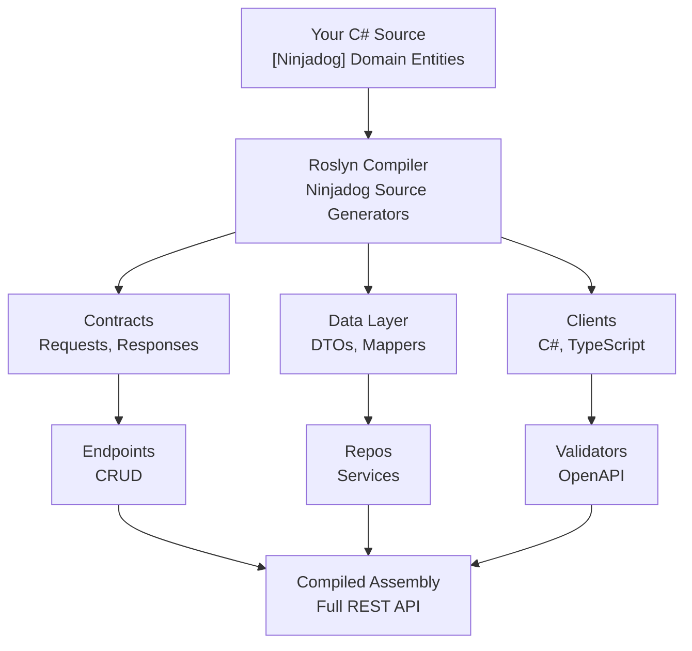

# Architecture
{: .no_toc }

How Ninjadog turns a single annotated class into a full REST API at compile time.
{: .fs-6 .fw-300 }

<details open markdown="block">
  <summary>Table of contents</summary>
  {: .text-delta }
1. TOC
{:toc}
</details>

---

## How It Works

When you build your project, Ninjadog hooks into the Roslyn compiler as a source generator. It discovers all classes annotated with `[Ninjadog]`, inspects their properties, and emits C# source files for every layer of the API stack.



The key insight: **everything happens at compile time**. No runtime reflection, no startup penalty, no external code-gen step. The generated files are part of your compiled assembly just like hand-written code.

## Key Design Decisions

| Decision | Rationale |
|---|---|
| **Compile-time generation** | No runtime reflection, no startup penalty, instant error feedback |
| **Source Generators (not T4/CLI)** | Integrated into the standard `dotnet build` pipeline -- no extra steps |
| **Per-entity isolation** | Each entity gets independent files; no cross-entity coupling or shared state |
| **Convention over configuration** | Sensible defaults for routes, validation, and database schema -- zero config needed |
| **Type-aware output** | Route constraints, SQL column types, and validation rules adapt automatically to property types |

## Tech Stack

| Layer | Technology |
|---|---|
| Runtime | .NET 10, C# 13 |
| Code Generation | Roslyn Source Generators |
| API Framework | FastEndpoints |
| Database | SQLite + Dapper |
| Validation | FluentValidation |
| OpenAPI | FastEndpoints.Swagger |
| Client Generation | FastEndpoints.ClientGen |
| Architecture | Domain-Driven Design (DDD) |
| CLI | Spectre.Console |

## Project Structure

```
ninjadog/
├── src/
│   ├── library/                             # Core generator libraries
│   │   ├── Ninjadog.Engine/                 # Main source generator engine
│   │   ├── Ninjadog.Engine.Core/            # Core generator abstractions
│   │   ├── Ninjadog.Engine.Infrastructure/  # Infrastructure utilities
│   │   ├── Ninjadog.Helpers/                # Shared helper functions
│   │   ├── Ninjadog.Settings/               # Generator configuration
│   │   └── Ninjadog.Settings.Extensions/    # Settings extension methods
│   ├── tools/
│   │   └── Ninjadog.CLI/                    # Command-line interface
│   ├── templates/
│   │   └── Ninjadog.Templates.CrudWebApi/   # CRUD Web API template
│   └── tests/
│       └── Ninjadog.Tests/                  # Snapshot + unit tests
├── docs/                                    # GitHub Pages documentation
├── doc/                                     # Generator reference docs
├── Ninjadog.sln                             # Solution file
└── global.json                              # .NET SDK version config
```

## NuGet Packages

| Package | Description |
|---|---|
| `Ninjadog.Engine` | Main source generator engine |
| `Ninjadog.Engine.Core` | Core generator abstractions |
| `Ninjadog.Engine.Infrastructure` | Infrastructure utilities |
| `Ninjadog.Helpers` | Shared helper functions |
| `Ninjadog.Settings` | Generator configuration |
| `Ninjadog.Settings.Extensions` | Settings extension methods |
| `Ninjadog.Templates.CrudWebApi` | CRUD Web API template |
| `Ninjadog.CLI` | Command-line tool (`dotnet tool install -g Ninjadog.CLI`) |

---

## Next Steps

- [Getting Started](/Ninjadog/getting-started) -- Build your first API
- [Generators](/Ninjadog/generators) -- Deep dive into all 30 generators
- [Generated Examples](/Ninjadog/examples) -- See real output code
