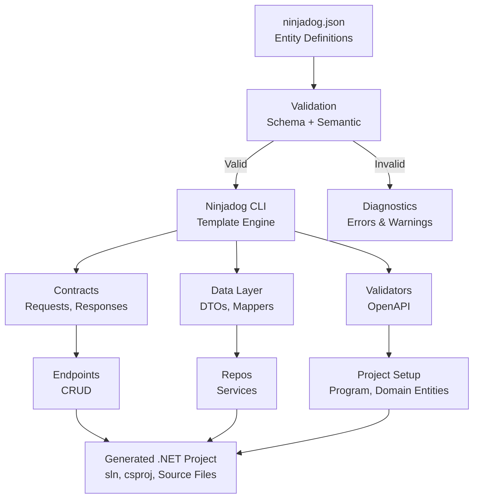

# Architecture
{: .no_toc }

How Ninjadog's CLI turns a simple configuration file into a full REST API project.
{: .fs-6 .fw-300 }

<details open markdown="block">
  <summary>Table of contents</summary>
  {: .text-delta }
1. TOC
{:toc}
</details>

---

## How It Works

When you run the Ninjadog CLI, it reads your `ninjadog.json` configuration file, discovers all defined entities and their properties, and uses template-based code generation to emit C# source files for every layer of the API stack.



The key insight: **everything is generated before you build**. The CLI creates a complete .NET project -- solution file, project files, NuGet references, and all source files -- written to disk via `DiskOutputProcessor`. The generated code is plain C# that compiles like any hand-written code.

## Key Design Decisions

| Decision | Rationale |
|---|---|
| **CLI-based generation** | No runtime reflection, no startup penalty, full control over output |
| **Template engine (NinjadogTemplate subclasses)** | Uses `IndentedStringBuilder` for clean, readable generated code -- no Roslyn APIs needed |
| **Per-entity isolation** | Each entity gets independent files; no cross-entity coupling or shared state |
| **Convention over configuration** | Sensible defaults for routes, validation, and database schema -- zero config needed |
| **Type-aware output** | Route constraints, SQL column types, and validation rules adapt automatically to property types |
| **Two-phase config validation** | JSON Schema checks structure first, then semantic rules catch logical errors (duplicate keys, invalid references) -- fail fast before generation |

## Tech Stack

| Layer | Technology |
|---|---|
| Runtime | .NET 10, C# 13 |
| Code Generation | Template-based Code Generation |
| API Framework | FastEndpoints |
| Database | SQLite + Dapper |
| Validation | FluentValidation |
| OpenAPI | FastEndpoints.Swagger |
| Client Generation | FastEndpoints.ClientGen |
| Architecture | Domain-Driven Design (DDD) |
| CLI | Spectre.Console |

## Project Structure

```
ninjadog/
├── src/
│   ├── library/                             # Core generator libraries
│   │   ├── Ninjadog.Engine/                 # Main code generation engine
│   │   ├── Ninjadog.Engine.Core/            # Core generator abstractions
│   │   ├── Ninjadog.Engine.Infrastructure/  # Infrastructure utilities
│   │   ├── Ninjadog.Helpers/                # Shared helper functions
│   │   ├── Ninjadog.Settings/               # Generator configuration
│   │   └── Ninjadog.Settings.Extensions/    # Settings extension methods
│   ├── tools/
│   │   └── Ninjadog.CLI/                    # Command-line interface
│   ├── templates/
│   │   └── Ninjadog.Templates.CrudWebApi/   # CRUD Web API template
│   └── tests/
│       └── Ninjadog.Tests/                  # Snapshot + unit tests
├── docs/                                    # GitHub Pages documentation
├── doc/                                     # Generator reference docs
├── Ninjadog.sln                             # Solution file
└── global.json                              # .NET SDK version config
```

## NuGet Package

```bash
dotnet tool install -g Ninjadog
```

The `Ninjadog` package is a global .NET tool that bundles the engine, templates, and all dependencies. The internal libraries (Engine, Settings, Helpers, etc.) are not published separately.

---

## Next Steps

- [Getting Started](/Ninjadog/getting-started) -- Build your first API
- [Validation](/Ninjadog/validation) -- Schema and semantic validation for ninjadog.json
- [Generators](/Ninjadog/generators) -- Deep dive into all 30 generators
- [Generated Examples](/Ninjadog/examples) -- See real output code
