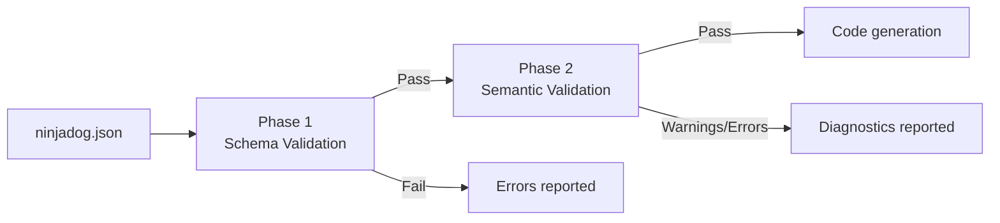

# Validation
{: .no_toc }

Catch configuration errors before code generation runs.
{: .fs-6 .fw-300 }

<details open markdown="block">
  <summary>Table of contents</summary>
  {: .text-delta }
1. TOC
{:toc}
</details>

---

## Overview

Ninjadog validates your `ninjadog.json` configuration in **two phases** before generating any code. This ensures that structural problems (malformed JSON, missing required fields) and logical problems (duplicate keys, invalid references) are caught early with clear, actionable diagnostics.



{: .note }
> Phase 2 only runs if Phase 1 passes. This avoids cascading errors from malformed JSON.

## Phase 1 -- Schema Validation

Schema validation checks that your configuration conforms to the [JSON Schema draft-07](http://json-schema.org/draft-07/schema#) definition embedded in Ninjadog. It verifies:

- **Structure** -- Required top-level sections (`config`, `entities`) are present
- **Types** -- Values have the correct JSON types (string, boolean, integer, object, array)
- **Required fields** -- Mandatory fields within each section exist (e.g., `config.name`, `config.version`, `config.rootNamespace`, `config.description`)
- **Allowed values** -- Enum-constrained fields use valid values (e.g., `database.provider` must be `sqlite`, `postgresql`, or `sqlserver`)
- **No extra properties** -- Unknown fields are rejected (`additionalProperties: false` throughout)

### What the Schema Covers

| Section | Required Fields | Optional Fields |
|---|---|---|
| `config` | `name`, `version`, `description`, `rootNamespace` | `outputPath`, `saveGeneratedFiles`, `cors`, `features`, `database` |
| `config.cors` | `origins` | `methods`, `headers` |
| `config.features` | -- | `softDelete`, `auditing` |
| `config.database` | -- | `provider` |
| `entities.<Name>` | `properties` | `relationships`, `seedData` |
| `entities.<Name>.properties.<Prop>` | `type` | `isKey`, `required`, `maxLength`, `minLength`, `min`, `max`, `pattern` |
| `entities.<Name>.relationships.<Rel>` | `relatedEntity`, `type` | -- |
| `enums` | -- | (each enum is a string array) |

### Schema Error Example

Given this configuration with a missing required field:

```json
{
  "config": {
    "name": "MyApi",
    "version": "1.0.0"
  },
  "entities": {}
}
```

Schema validation reports:

```
SCHEMA  Error  $.config  Required properties ["description","rootNamespace"] are not present
```

## Phase 2 -- Semantic Validation

Once the JSON structure is valid, Ninjadog parses the configuration and checks for logical correctness. Each check has a unique diagnostic code.

### Diagnostic Codes

| Code | Severity | Description |
|---|---|---|
| **NINJ001** | Error | Entity must have exactly one `isKey` property |
| **NINJ002** | Error | Relationship references a non-existent entity |
| **NINJ003** | Error | Seed data field name does not match any property |
| **NINJ004** | Warning | Seed data value may not match the property type |
| **NINJ005** | Error | Property type is not a built-in type and not defined in the `enums` section |
| **NINJ006** | Error | `minLength` is greater than `maxLength` |
| **NINJ007** | Error | `min` is greater than `max` |
| **NINJ008** | Warning | Entity name is not PascalCase |
| **NINJ009** | Warning | Enum contains duplicate values |
| **NINJ010** | Warning | Seed data contains duplicate key values |

### Built-in Types

The following types are recognized as built-in. Any other type must be defined in the `enums` section or exist as an entity name:

`string`, `int`, `Int32`, `long`, `Int64`, `float`, `Single`, `double`, `decimal`, `bool`, `Boolean`, `Guid`, `DateTime`, `DateTimeOffset`, `DateOnly`, `TimeOnly`, `byte[]`, `List<T>`

### Semantic Error Example

Given this configuration with two key properties and a non-existent relationship target:

```json
{
  "config": {
    "name": "MyApi",
    "version": "1.0.0",
    "description": "My API",
    "rootNamespace": "MyApi"
  },
  "entities": {
    "Order": {
      "properties": {
        "Id": { "type": "Guid", "isKey": true },
        "Code": { "type": "string", "isKey": true },
        "Status": { "type": "OrderStatus" }
      },
      "relationships": {
        "customer": {
          "relatedEntity": "Customer",
          "type": "OneToMany"
        }
      }
    }
  }
}
```

Semantic validation reports:

```
NINJ001  Error    $.entities.Order.properties         Entity 'Order' must have exactly one isKey property, but found 2.
NINJ002  Error    $.entities.Order.relationships.customer.relatedEntity  Relationship 'customer' in entity 'Order' references non-existent entity 'Customer'.
NINJ005  Error    $.entities.Order.properties.Status.type  Property 'Status' in entity 'Order' uses type 'OrderStatus' which is not a built-in type and is not defined in the enums section.
```

{: .tip }
> Fix NINJ005 by adding an `enums` section: `"enums": { "OrderStatus": ["Pending", "Shipped", "Delivered"] }`.

## Severity Levels

| Severity | Meaning | Blocks Generation? |
|---|---|---|
| **Error** | The configuration cannot be used as-is | Yes |
| **Warning** | A potential issue that may cause unexpected behavior | No |
| **Info** | An informational note about the configuration | No |

Errors prevent code generation from proceeding. Warnings are reported but do not block generation.

## IDE Support with `$schema`

Add a `$schema` property to your `ninjadog.json` to get autocomplete, inline documentation, and real-time validation in editors like VS Code, JetBrains Rider, and Neovim:

```json
{
  "$schema": "https://raw.githubusercontent.com/Atypical-Consulting/Ninjadog/main/src/library/Ninjadog.Settings/Schema/ninjadog.schema.json",
  "config": {
    "name": "MyApi",
    "version": "1.0.0",
    "description": "My API",
    "rootNamespace": "MyApi"
  },
  "entities": {
    "Product": {
      "properties": {
        "Id": { "type": "Guid", "isKey": true },
        "Name": { "type": "string" }
      }
    }
  }
}
```

{: .note }
> The `$schema` property is ignored by Ninjadog at runtime -- it exists solely for editor integration. You can safely add or remove it without affecting code generation.

### What You Get

- **Autocomplete** -- Property names, enum values (`sqlite`, `postgresql`, `sqlserver`), and relationship types are suggested as you type
- **Inline docs** -- Hover over any property to see its description from the schema
- **Error highlighting** -- Missing required fields, wrong types, and unknown properties are underlined immediately

## Programmatic Usage

The validation framework is available in the `Ninjadog.Settings.Validation` namespace:

```csharp
using Ninjadog.Settings.Validation;

var json = File.ReadAllText("ninjadog.json");
var result = NinjadogConfigValidator.Validate(json);

if (!result.IsValid)
{
    foreach (var error in result.Errors)
    {
        Console.Error.WriteLine($"{error.Code}  {error.Path}  {error.Message}");
    }
}

foreach (var warning in result.Warnings)
{
    Console.WriteLine($"Warning: {warning.Code}  {warning.Path}  {warning.Message}");
}
```

The `SchemaValidationResult` record provides:

| Property | Type | Description |
|---|---|---|
| `IsValid` | `bool` | `true` if no errors were found (warnings are allowed) |
| `Diagnostics` | `IReadOnlyList<ValidationDiagnostic>` | All diagnostics (errors, warnings, info) |
| `Errors` | `IReadOnlyList<ValidationDiagnostic>` | Only error-severity diagnostics |
| `Warnings` | `IReadOnlyList<ValidationDiagnostic>` | Only warning-severity diagnostics |

Each `ValidationDiagnostic` contains:

| Field | Type | Description |
|---|---|---|
| `Code` | `string` | Diagnostic code (e.g., `NINJ001`, `SCHEMA`) |
| `Message` | `string` | Human-readable description |
| `Severity` | `ValidationSeverity` | `Error`, `Warning`, or `Info` |
| `Path` | `string` | JSON path where the issue was found (e.g., `$.entities.Order.properties`) |

---

## Next Steps

- [Getting Started](/Ninjadog/getting-started) -- Build your first API
- [Architecture](/Ninjadog/architecture) -- Understand the design decisions and tech stack
- [CLI Reference](/Ninjadog/cli) -- Scaffold projects with the CLI tool
